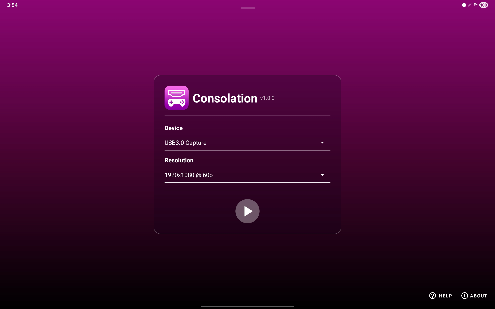
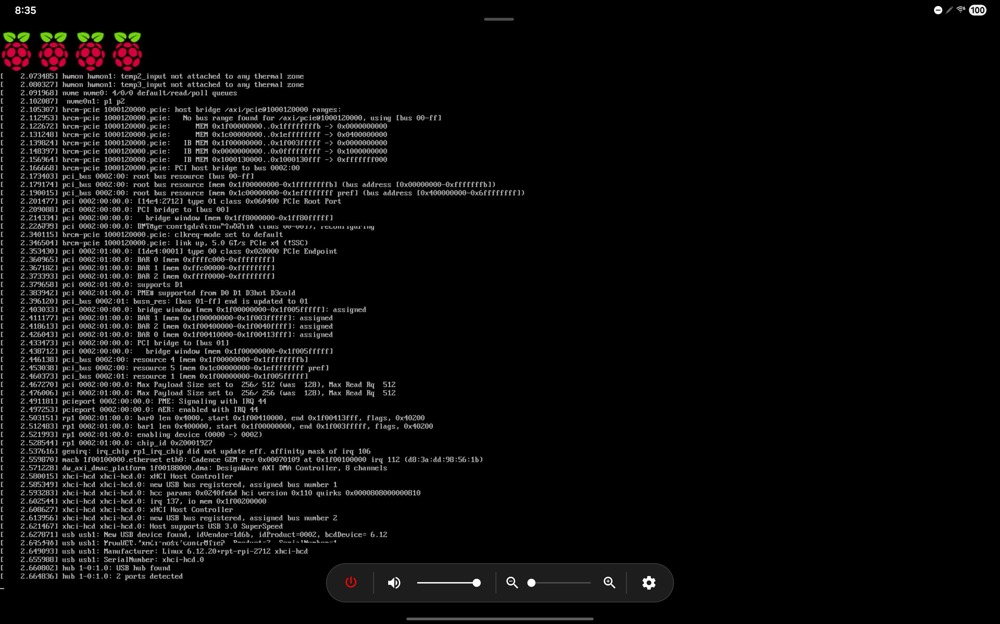
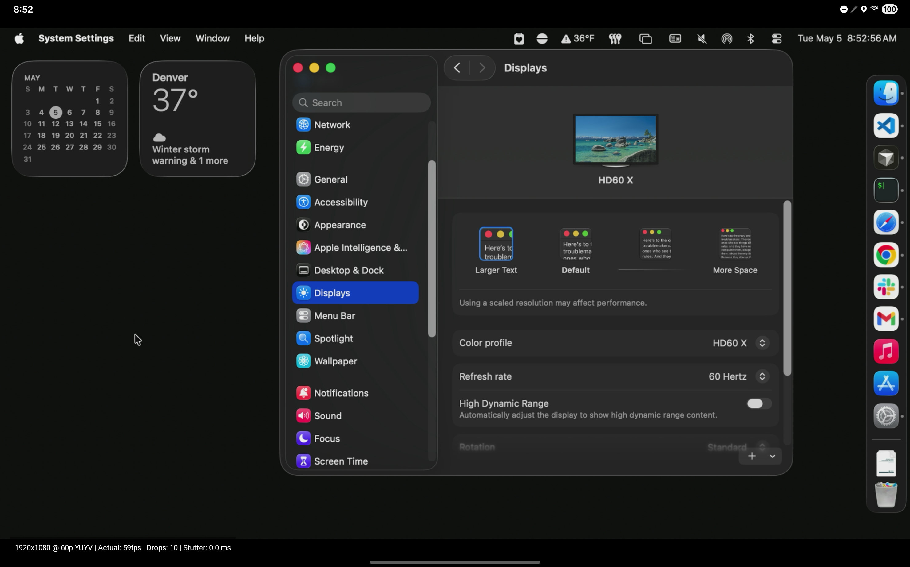
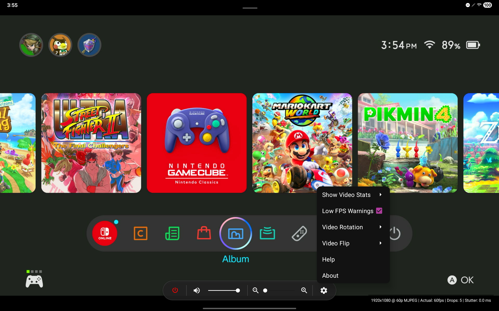
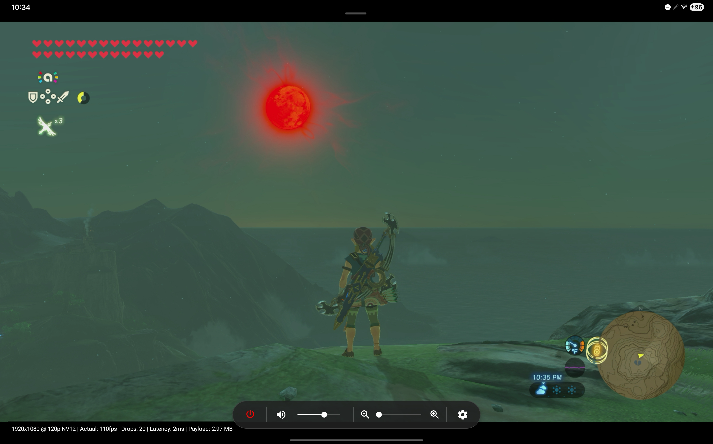

#  Consolation™ 

A 100% free, no-frills, incredibly performant video capture viewer for Android tablets with no analytics or snooping.

Consolation can be [installed from the Play Store](https://play.google.com/store/apps/details?id=org.centennialoss.consolation), or can be downloaded directly from [this project's releases](https://github.com/centennial-oss/consolation-android/releases).

## About

Consolation is a free app that enables your Android tablet to be used as a display for devices like gaming consoles, Raspberry Pis, and even a Mac mini or other PC, via a standard USB Video Class (UVC) video capture card.

Consolation is _blazingly fast_, with less real-time lag than anything you've ever used before on Android. Seriously, its performance will blow your mind. On capable capture cards (including many available for less than $30 online), it is difficult to notice any latency at all, even at 1440p/60 and higher.

The app is intentionally simple: watch the live video on your tablet. No recording or saving, no streaming to the internet. Just plug and play, privately with no ads or tracking. Consolation will never make an outbound network request or listen for inbound network connections.

## Screenshots

 

   

## Privacy

Consolation does not collect, send, or share your data. Audio and video stay local and transient while you are watching a connected capture device. The app is open source, contains no trackers or analytics, makes no network calls, and does not record, stream, save, or analyze audio or video. Consolation has no idea what content is coming through your capture card's feed, and nothing leaves your device, ever.

Read the full privacy policy at [PRIVACY.md](PRIVACY.md) or <https://centennialoss.org/privacy/>.

## Supported Capture Devices

Any capture device that appears to the Android OS as a USB Video Class (UVC) capture device should work with Consolation.

Consolation has been tested by the developers on a Samsung Galaxy Tab S8 Ultra (SM-X900) with these capture devices:

- Elgato HD60 X - 👌 🚀
- Acer USB 3.0 Video Capture Card (model OCB5B0) - 👌 🚀
- WANKEDA 4K Capture Card 1080p 60FPS for Streaming (1da603d4) - 👌 🚀
- blueAVS 4K Capture Card (A3-B) - 👌 🚀
- Guermok Video Capture Card (GM-29A) - 👌 🚀
- PERESAL USB 3.0 Video Capture Card with PD 100W - 👌 🚀
- UGREEN Full HD 1080p Capture Card (model 40189) -  ⚠️ max 30p @ 1920x1080

## Requirements

### Running

- Android device with a USB port
- Android OS 15 or higher
- A UVC-compliant video capture card

### Developer

- Android Studio Panda 4 or higher

## Building

1. Open the `Consolation` directory in Android Studio
2. Build and run.

You can make a debug build with `make build` and a release build with `make build-release`.

## Acknowledgements

### libjpeg-turbo
We use [libjpeg-turbo v3.1.4.1](https://github.com/libjpeg-turbo/libjpeg-turbo) unmodified to decode the MJPEG pixel format.

### libusb
We use [libusb v1.0.29](https://github.com/libusb/libusb) unmodified to stream from UVC capture cards.

### UVCCamera and libuvc

We vendored <https://github.com/alexey-pelykh/UVCCamera> into Consolation for Android. Alexey's project is a fork of <https://github.com/saki4510t/UVCCamera> which has gone dormant. We thank both projects for helping make Consolation for Android possible.

UVCCamera depends on <https://github.com/libuvc/libuvc>, which we have also vendored.

#### UVCCamera and libuvc Improvements

We have significantly modified our vendored UVCCamera and libuvc libs for stability and performance. These mods are in the codebase at [Consolation/app/src/main/jni/UVCCamera](Consolation/app/src/main/jni/UVCCamera) and [Consolation/app/src/main/jni/libuvc](Consolation/app/src/main/jni/libuvc):
* eliminated nearly all frame copies, resulting in significant lag reduction
* added support for H.264, NV12, and P010 input pixel formats
* fixed defects in yuyv2iyuv and any2yuv frame handlers
* added support for input pixel format probe
* fixed protocol defects causing some capture cards to incur unnecessary startup delays
* numerous other performance improvements for a true real-time experience on modern Android devices with modern capture cards

### Upstreaming

We really would like to contribute our changes back to their upstreams. But after significant research, we've determined that the lift is too great and our time is better spent improving the core Consolation project and continuing to maintain our modifications inside of this project. As this project is open source, anyone is welcome to attempt to port our improvements back to their respective upstreams or other forks.

We _may_ publish our own separate disconnected fork of UVCCamera - specific to Android video capture and complete with our modified libusb and libuvc packages - that can be used as a drop-in replacement to take advantage of all of the stability and performance improvements we've introduced. Stay tuned.

#### Rationale for Upstreaming Declination

* libuvc has not been updated in nearly 3 years with dozens of open PRs piling up, so it is unlikely that our overhaul would ever be incorporated into that apparently dormant or abandoned project.
* Alexey's UVCCamera fork has gained little traction since its creation in late 2024, is largely unchanged from Saki's original project excecpt the addition of a flutter plugin, and has not seen a new release in over a year (and just a few months after the fork was created). It appears to be headed towards dormancy.

## Contributor Disclosure

Humans write this software with AI assistance. All contributions are well-tested and merged only after being reviewed and approved by humans who fully understand and take responsibility for the contribution.

While we welcome pull requests and other contributions from other humans, including AI-generated code, we do not accept contributions from AI bots. A human must review, understand, and sign off on all commits. All contributors must be able to defend their contributions under reasonable technical scrutiny. Please file an issue to discuss any proposed feature before working on it.

## Trademark Notice

Consolation and its logo are trademarks of Centennial OSS Inc.
Use of the name and branding is not permitted for modified versions or forks without permission.
See [TRADEMARKS.md](TRADEMARKS.md) for details.
